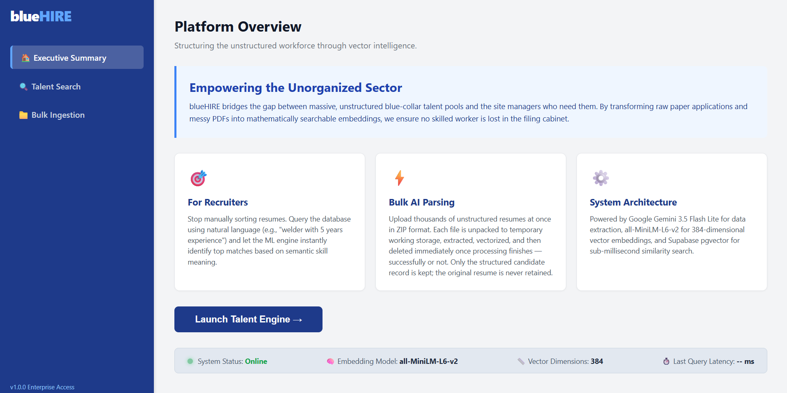
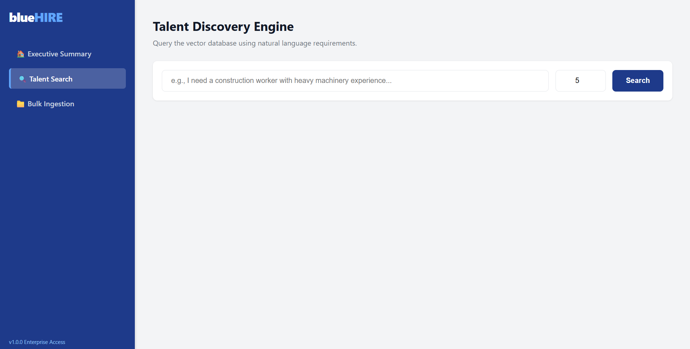
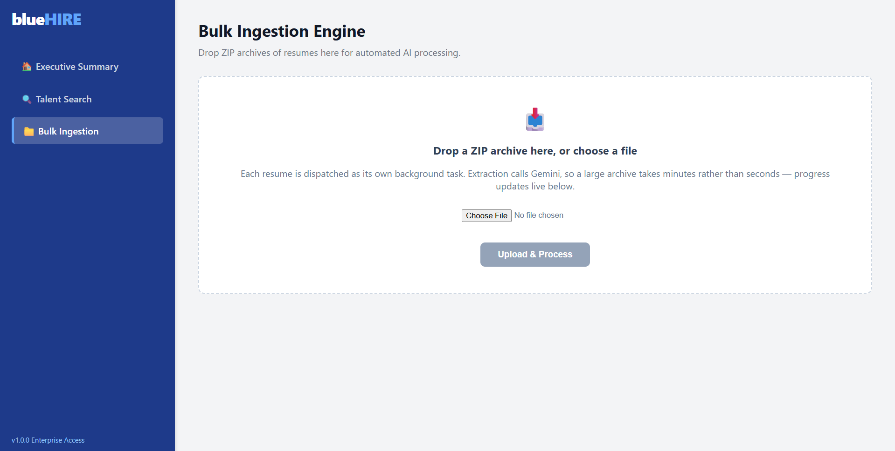
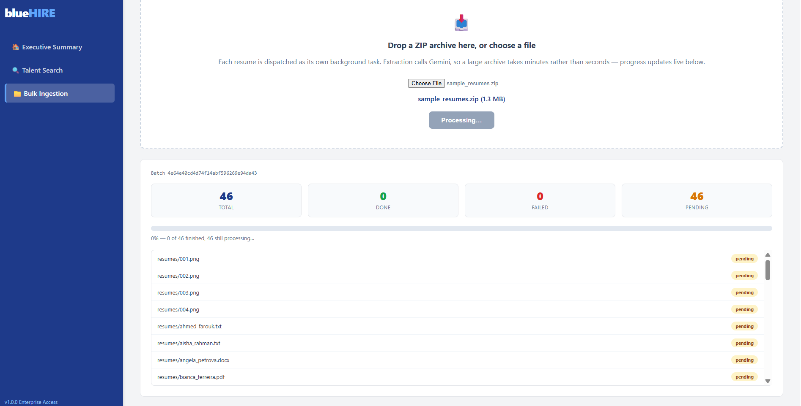
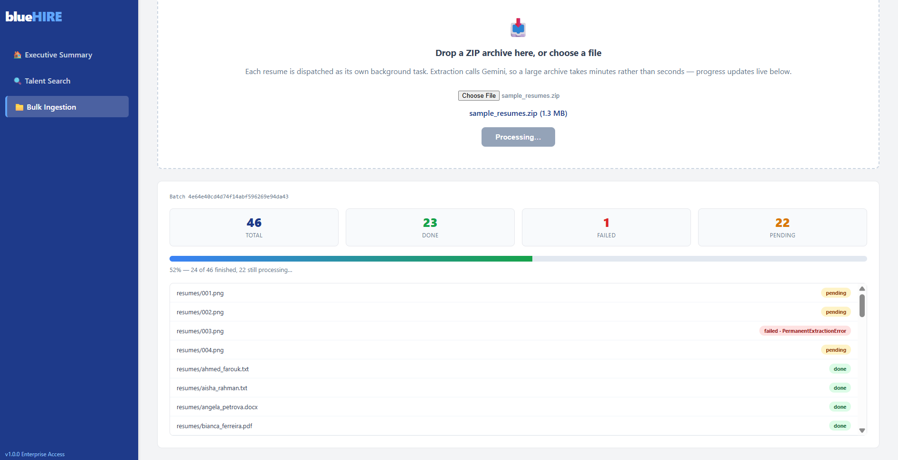
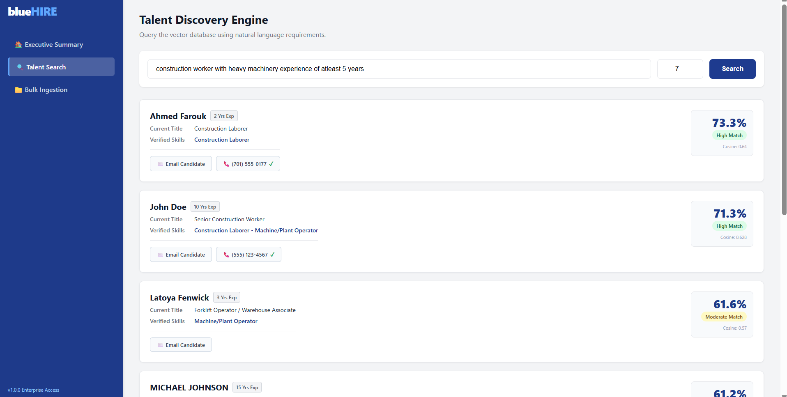
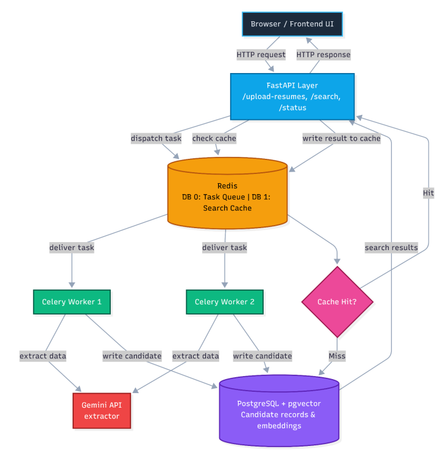

# BlueHire Portal — Talent Discovery Engine for Blue-Collar Hiring

     

Resumes (PDF, DOCX, image, or plain text) are parsed by Gemini into a structured
candidate profile, embedded with a local sentence-transformer model, and stored
in Postgres with `pgvector`. Recruiters search the candidate pool using plain
natural-language queries — "electrician with heavy machinery experience" —
ranked by semantic similarity, not keyword matching.

## Contents

- [What it looks like](#what-it-looks-like)
- [Architecture](#architecture)
- [Setup](#setup)
- [Verifying the claims in this document](#verifying-the-claims-in-this-document)
- [Design decisions worth knowing](#design-decisions-worth-knowing)
- [Capacity — measured, not estimated](#capacity--measured-not-estimated)
- [Search performance](#search-performance)
- [Testing](#testing)
- [Known, named limitations](#known-named-limitations)

## What it looks like


The landing page — what the product is and how it's built, before touching any feature.


Talent Search, before any query has been run.


Bulk Ingestion, before a file has been selected.


A 46-file archive just dispatched — 0 of 46 done, all still pending.


The same batch at 52% — per-file status, including a real failed extraction
(`PermanentExtractionError`) surfaced next to the file that hit it, not hidden
behind an aggregate count. `resumes/003.png` is a normal, legible resume, not
unreadable content — `PermanentExtractionError` here means retrying cannot
fix it (a rejected API request or a model response that failed schema
validation; see `extraction.py`), distinct from `TransientExtractionError`
(5xx/network/rate-limit, retried automatically up to 5 times). Either way the
failure is isolated to this one file — the rest of the batch keeps running.


Real semantic search results for a natural-language query, ranked and scored
against the corpus that batch produced.

## Architecture

<p align="center"></p>

*Figure 1: System Architecture*

```text
extraction.py       # sole Gemini-calling module — schema, retry policy, embedding
server.py           # FastAPI app — /search, /upload-resumes/, /status/{batch_id}, /health
config.py           # single source for .env loading, DB config, logging setup
db.py, cache.py     # Postgres upsert logic, Redis cache/broker access
celery_app.py       # Celery configuration — concurrency, rate limit, retry policy
tasks.py            # per-file extraction task, dispatched as a Celery group
jobs.py             # batch progress tracking (Redis)
frontend/           # served directly by FastAPI — bulk upload UI + search
scripts/            # pipeline.py (CLI batch), migrate.py, vectorize.py, seed generator,
                    # apply_migration.py (applies migrations like the HNSW index to a live DB)
migrations/         # incremental SQL: schema, phone dedup, HNSW index
tests/              # 288 pytest tests
```

**Stack:** FastAPI · Celery · Redis · PostgreSQL + `pgvector` · Docker Compose ·
Gemini API (`gemini-3.5-flash-lite`) · `all-MiniLM-L6-v2` (local, free embeddings)

## Setup

```bash
git clone https://github.com/princeK9/bc_portal.git
cd bc_portal
cp .env.example .env       # fill in your own Gemini key + Supabase credentials
docker compose up --build
```

Open `http://localhost:8000` to use the app directly. Every external dependency
(API key, database, Redis, embedding model) is read from environment variables,
nothing is hardcoded.

## Verifying the claims in this document

This repo ships with a 288-test suite that backs every number stated above — the
HNSW speedup, the redelivery guarantee, the dedup logic, the live-tested rate
limit. Rather than take these on trust, run it yourself:

```bash
python -m venv venv && source venv/bin/activate   # Windows: venv\Scripts\activate
pip install -r requirements-dev.txt
pytest
```

278 of these run with zero setup. The remaining 10 exercise real multi-format
file decoding (`.docx`/`.png`) and the full spool → extract → dedupe pipeline
against actual files, and need a matching sample resume corpus at
`sample_data/sample_resumes.zip` and `sample_data/resumes/` — available on
request — otherwise they skip cleanly with a stated reason rather than
failing.

## Design decisions worth knowing

- **One extraction module, one place Gemini gets called.** No duplicated logic
  between the live API and the CLI batch tool — a real bug earlier in this
  project's history came from exactly that kind of duplication silently
  diverging.
- **Async API, synchronous workers, by design.** FastAPI's event loop handles
  concurrent requests; Celery's workers scale by adding slots, not by avoiding
  blocking. They connect only through Redis — never share an execution context.
- **Deduplication on phone number, not email.** For this labor market, phone is
  the reliably-maintained identifier. A known placeholder/reserved-number
  blocklist prevents unrelated candidates who share a template phone number
  from being silently merged into one record.
- **Every file is deleted immediately after processing** — success, failure, or
  exhausted retries. Nothing is retained beyond the structured candidate
  record.
- **Redis does two separate jobs on two separate logical databases** — task
  queue and search cache — specifically so clearing one can never destroy the
  other.

## Capacity — measured, not estimated

Gemini's free tier was live-tested, not assumed: **15 requests/minute**,
confirmed directly from a real quota-exceeded response. That's a hard ceiling
of ~21,600 requests/day at continuous 100% duty cycle.

A 50,000-resume/day target is not reachable on the free tier by any amount of
tuning. It's comfortable on the cheapest paid tier (billing enabled, zero
minimum spend): Google's published Tier 1 limit of 150–300 requests/minute
gives 1.4x–8.6x headroom over the target, with no code changes required —
every external dependency is already environment-driven.

A tested (not just proposed) fallback across the two free-tier models with
meaningful daily quota roughly doubles free-tier capacity as a documented
stopgap; full detail and both options' trade-offs available on request.

## Search performance

An HNSW index plus a transport-level query fix brought `/search`'s database
round-trip from ~47ms to ~1.5ms, and the full endpoint from ~67ms to ~42ms —
a 68x server-side improvement that only moved end-to-end latency ~40%,
because the database was never really the bottleneck. Verified with `EXPLAIN`
and byte-identical result comparisons before and after. Of that ~42ms, the
database is now ~1.5ms; the ~40ms MiniLM embedding step is the dominant piece
remaining, and is already the correct target for any further optimization —
not the database.

## Testing

288 automated tests, plus live, non-mocked verification at every level:
a real 46-file batch processed end-to-end through Docker, a worker killed
mid-batch to confirm task redelivery actually works (not just configured),
and the UI itself driven through a real headless browser rather than tested
only at the API layer.

## Known, named limitations

- No authentication yet — anyone reaching the port can upload and search.
- Free-tier capacity, as above, does not reach a high-volume production
  target without enabling billing.
- Deduplication doesn't preserve provenance — when two files merge onto one
  candidate, only the most recent source filename is kept.
- "Most recent upload wins" holds for sequential uploads but not within a
  single batch — parallel workers can resolve two versions of the same person
  by scheduling order rather than recency; deliberately left undefended since
  no reliable ordering exists in the input.

---

Built through a structured, level-by-level refactor with extensive live
testing at every stage — happy to walk through the reasoning behind any
decision above in more detail.